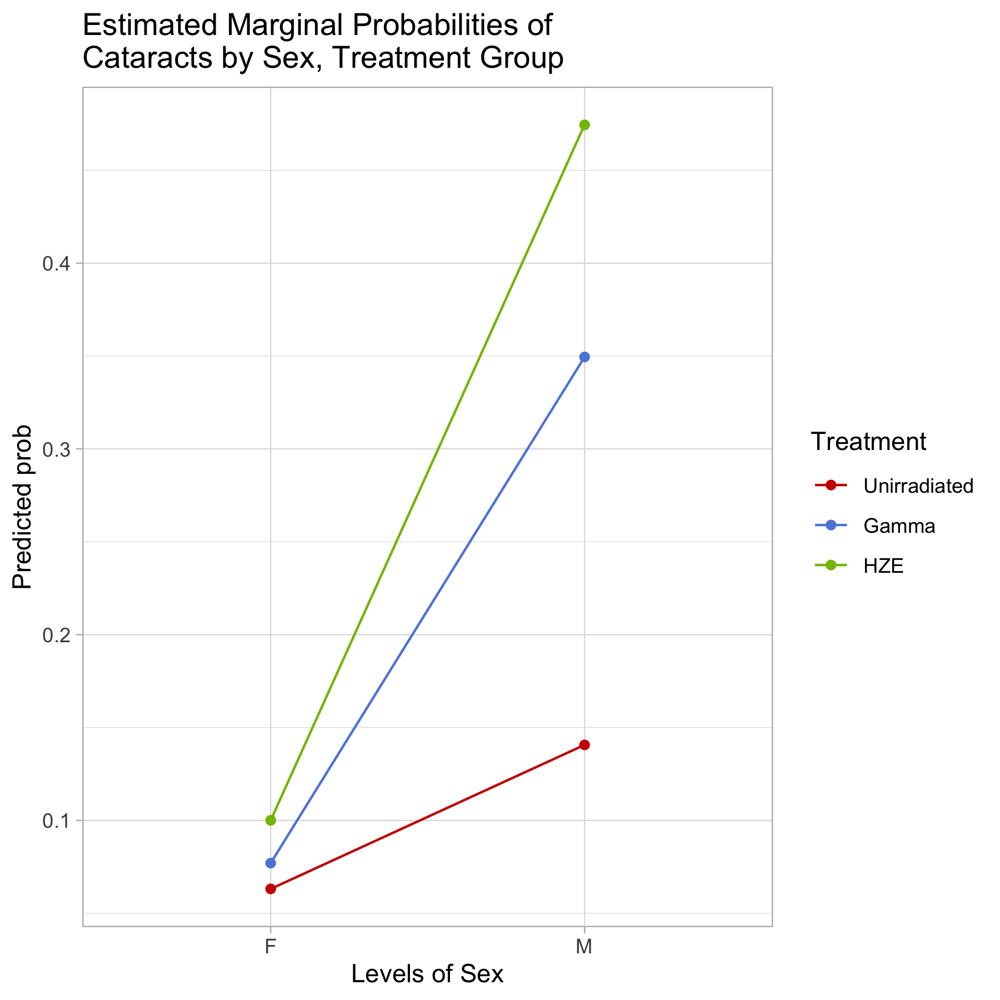

```{r setup, include=FALSE}
knitr::opts_chunk$set(echo = FALSE)
```  


## Introduction
  
- Research Questions:   
    + Is there a genetic susceptibility to cataracts caused by radiation?  
    + Accounting for potential genetic susceptibility, is there a difference in cataract presentation between HZE radiation and gamma radiation? 
- Experimental Design:  
    + 1820 genetically heterogeneous mice from 48 unique families were randomly assigned, with equal family weights, to three treatment groups: Gamma radiation, HZE radiation, and unirradiated control. The simplified dataset records symptoms at time of death for mice of Age $\ge$ 552 days, for a total sample size of 1169.   
    + **Response**: Cataracts score, ordinal categorical variable on a scale 0-5. Score $\ge$ 2 indicates presence of cataracts; because sample sizes in ordinal categories are small, we decided to convert the response into a binary variable indicating absence or presence of cataracts.  
    + **Primary predictors under consideration**: Treatment, Family  
    + **Covariates**: Sex, Weight, Coat Color, Body Condition Score, Age, Myeloid Leukemia, Harderian Tumor, PreT Lymphoma
- Methods Overview:  
    + Mixed Logistic Regression with Treatment as a fixed effect, Family as a random effect, and accounting for any practically significant covariates. Obtain estimates for odds ratios. 
    + Bayesian Mixed Logistic Regression counterpart to Frequentist final model to obtain probability distributions for odds ratios.  

## Summary Tables & Plots  
 + add barplot of empirical proportions
 + add lineplot of avg family score by sex, treatment (update title to proportion)


## Final Model

The final model can be written as:  
\[
\begin{aligned}
Y \sim\ &Binomial(1169, p)\ \ \mbox{or parameterized as   }\  Y_{ij} \sim Bernoulli(p) \\
log(\frac{p}{1-p}) = &\ \beta_0*Control_i*F_i\ +\beta_1*Gamma_i*F_i\ + \beta_2*HZE_i*F_i\ + \\ &\beta_3*Control_i*M_i\ +\beta_4*Gamma*M\ + \beta_5*HZE*M\ + \\
[&v_{j} + \epsilon_{ij}] \\
&i = 1, ..., 1169\ \mbox{ mice} \\
&j = 1,...,47\ \ \mbox{ families}
\end{aligned}
\]  

The final Bayesian model can be written as:  
\[
\begin{aligned}
Y \sim Binomial&(1169, p) \ \mbox{   or parameterized as   }\ \ \  Y_{ij} \sim Bernoulli(p)\\
log(\frac{p}{1-p}) = &\ \beta_0*Control_i*F_i\ +\beta_1*Gamma_i*F_i\ + \beta_2*HZE_i*F_i\ + \\ &\beta_3*Control_i*M_i\ +\beta_4*Gamma*M\ + \beta_5*HZE*M\ + \\
&v_{ij} + \epsilon_{ij}\\
&i = 1, ..., 1169\ \mbox{ mice} \\
&j = 1,...,47\ \ \mbox{ families, and} \\
v_j \sim N(0, \tau)
\end{aligned}
\]  


With non-informative priors:  
\[
\begin{aligned}
\beta_0 &\sim N(0, 0.001)\\
\beta_1 &\sim N(0, 0.001)\\
\beta_2 &\sim N(0, 0.001)\\
\beta_3 &\sim N(0, 0.001)\\
\beta_4 &\sim N(0, 0.001)\\
\beta_5 &\sim N(0, 0.001)\\
\tau &\sim Gamma(0.001, 0.001) \mbox{ where}\ \sigma^2 = 1/\tau\\
\end{aligned}
\]
 
## Results

## Results continued {.flexbox .vcenter}
<div class="centered">
{width=70%, height=70%}
</div>
  
## Conclusions
 + Fixed effects conclusions
 + RE conclusions based on model selection and HPD Interval
 + Presence of competing risks complicates inference
 
Any Questions? (applause!)
  
## References
